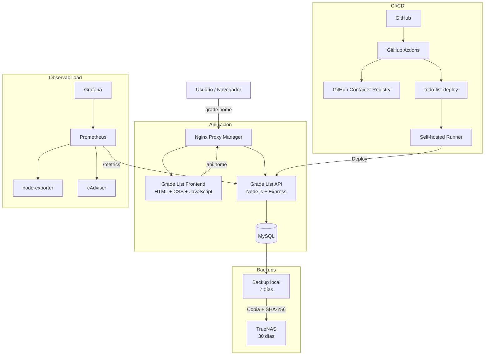

# Grade List API

Backend REST de **Grade List** para la gestión de tareas por usuario, desarrollado con Node.js, Express y MySQL.

El proyecto incluye autenticación JWT, aislamiento de recursos entre usuarios, validación de datos, documentación Swagger, pruebas automatizadas, seguridad a nivel de aplicación y contenedor, Docker, CI/CD con GitHub Actions, publicación de imágenes en GitHub Container Registry, despliegue automático con rollback, backups y observabilidad.

---

## Descripción

Grade List permite que cada usuario pueda registrarse, iniciar sesión y administrar sus propias tareas mediante una API protegida con autenticación JWT.

Cada usuario puede:

- Registrarse.
- Iniciar sesión.
- Crear tareas.
- Consultar sus tareas.
- Obtener una tarea por ID.
- Actualizar el título de una tarea.
- Cambiar el estado completada/pendiente.
- Actualizar campos de una tarea.
- Eliminar tareas.
- Filtrar tareas completadas o pendientes.

Las operaciones sobre tareas están asociadas al usuario autenticado mediante JWT.

Esto evita que un usuario pueda consultar, modificar o eliminar tareas pertenecientes a otro usuario.

---

## Arquitectura general



La arquitectura separa la aplicación, los backups, la observabilidad y el flujo CI/CD utilizado para desplegar Grade List.

---

## Tecnologías utilizadas

### Backend

- Node.js 22
- Express
- MySQL 8
- JWT
- bcrypt
- dotenv
- CORS
- Helmet
- express-rate-limit

### Documentación

- Swagger
- Swagger UI

### Testing

- Node Test Runner
- Supertest

### DevOps

- Docker
- Docker Compose
- Git
- GitHub
- GitHub Actions
- GitHub Container Registry (GHCR)
- Self-hosted GitHub Actions Runner

### Observabilidad

- Prometheus
- Grafana
- node-exporter
- cAdvisor

### Infraestructura

- Linux
- Nginx Proxy Manager
- TrueNAS

---

## Características principales

### Autenticación

La API utiliza JWT para proteger las rutas privadas.

Las tareas utilizan el usuario obtenido desde el token:

```text
JWT
 ↓
verifyToken
 ↓
req.user.id
 ↓
consulta MySQL filtrada por user_id
```

El cliente no puede seleccionar manualmente el `user_id` propietario de una tarea.

---

## Seguridad

El proyecto aplica medidas de seguridad tanto a nivel de aplicación como de contenedor.

### Seguridad de aplicación

- Contraseñas almacenadas utilizando bcrypt.
- Tokens JWT con tiempo de expiración.
- `JWT_SECRET` almacenado mediante variables de entorno.
- Validación del formato del token Bearer.
- Validación de correo electrónico.
- Contraseñas entre 8 y 72 caracteres.
- Títulos de tareas entre 3 y 255 caracteres.
- Validación de IDs de tareas.
- Validación del filtro `completada`.
- Aislamiento de recursos entre usuarios.
- Respuestas genéricas para errores internos.
- CORS configurable mediante variables de entorno.
- Headers HTTP de seguridad mediante Helmet.
- Rate limiting aplicado a las rutas de autenticación.
- Cabecera `X-Powered-By` deshabilitada.
- Credenciales excluidas del repositorio.
- Archivos `.env` excluidos mediante `.gitignore`.
- Auditoría de dependencias mediante `npm audit`.

Cuando un usuario intenta acceder a una tarea que no le pertenece, la API responde como recurso no encontrado.

Esto evita revelar la existencia de recursos pertenecientes a otras cuentas.

### Hardening del contenedor

El contenedor de producción utiliza:

- Usuario no root (`node`).
- Filesystem configurado como solo lectura.
- `no-new-privileges`.
- Eliminación de capabilities mediante `cap_drop: ALL`.
- `/tmp` montado mediante `tmpfs`.
- Límites de CPU y memoria.
- Healthcheck de Docker.
- Imagen base de Node fijada por digest.

La base de datos MySQL utilizada en producción también se ejecuta mediante una imagen fijada por digest.

---

## Endpoints principales

### Autenticación

```text
POST /auth/register
POST /auth/login
```

### Tareas

```text
GET    /api/tareas
POST   /api/tareas
GET    /api/tareas/:id
PUT    /api/tareas/:id
DELETE /api/tareas/:id
PATCH  /api/tareas/:id/toggle
```

---

## Filtros

Para obtener tareas completadas:

```text
GET /api/tareas?completada=true
```

Para obtener tareas pendientes:

```text
GET /api/tareas?completada=false
```

El filtro solamente acepta:

```text
true
false
```

Un valor diferente devuelve:

```text
400 Bad Request
```

---

## Health checks

La API dispone de endpoints para comprobar su estado.

### Health

```text
GET /health
```

Ejemplo:

```json
{
  "status": "ok",
  "service": "todo-api",
  "version": "1.1.3"
}
```

Este endpoint confirma que el proceso de la API está funcionando.

También permite identificar la versión actualmente desplegada.

### Readiness

```text
GET /ready
```

Ejemplo:

```json
{
  "status": "ready",
  "service": "todo-api",
  "database": "connected"
}
```

Este endpoint confirma que la API puede comunicarse correctamente con MySQL.

---

## Métricas

La API expone métricas para Prometheus mediante:

```text
GET /metrics
```

Prometheus recopila estas métricas periódicamente para permitir el monitoreo de la aplicación.

---

## Manejo de errores

Las rutas inexistentes responden en formato JSON.

Ejemplo:

```json
{
  "success": false,
  "error": "Ruta no encontrada"
}
```

Los errores internos utilizan una respuesta genérica y no exponen detalles sensibles al cliente.

Ejemplo:

```json
{
  "success": false,
  "error": "Error interno del servidor"
}
```

Los detalles técnicos permanecen únicamente en los logs del servidor.

---

## Documentación Swagger

La API dispone de documentación interactiva mediante Swagger UI.

Con la aplicación ejecutándose:

```text
http://localhost:3000/docs
```

Swagger permite consultar los endpoints disponibles y realizar pruebas utilizando autenticación Bearer JWT.

---

## Pruebas automatizadas

El proyecto cuenta actualmente con **38 pruebas automatizadas**.

Las pruebas cubren, entre otros casos:

- Ruta principal de la API.
- Health check.
- Readiness check.
- Peticiones sin token.
- Tokens inválidos.
- Registro de usuarios.
- Inicio de sesión.
- Creación de tareas.
- Consulta de tareas.
- Consulta de tareas por ID.
- Actualización de tareas.
- Actualización parcial de campos.
- Eliminación de tareas.
- Toggle de tareas.
- Filtro de tareas completadas.
- Filtro de tareas pendientes.
- Filtros inválidos.
- Validación de títulos.
- Validación de IDs.
- Validación de tipos de datos.
- Aislamiento entre usuarios.
- Respuestas 404.
- Protección de información en errores 500.

Para ejecutar las pruebas:

```bash
cd api
npm test
```

Las pruebas de integración utilizan MySQL.

---

## CI con GitHub Actions

El proyecto utiliza GitHub Actions para validar automáticamente los cambios antes de integrarlos.

El pipeline de CI incluye:

```text
Checkout
   ↓
Node.js 22
   ↓
Servicio temporal MySQL 8
   ↓
npm ci
   ↓
Validación de sintaxis JavaScript
   ↓
Carga del esquema de base de datos
   ↓
38 pruebas automatizadas
   ↓
npm audit
   ↓
Validación de Docker Compose
   ↓
Construcción de imagen Docker
```

Las pruebas de integración utilizan una instancia temporal de MySQL dentro del workflow.

Esto permite comprobar la aplicación, la base de datos y la construcción de la imagen antes de integrar cambios a la rama principal.

---

## Docker

El proyecto dispone de configuraciones separadas para desarrollo y producción.

### Desarrollo

```text
docker-compose.yml
```

Esta configuración permite trabajar utilizando el código fuente local.

### Producción

```text
docker-compose.prod.yml
```

La configuración de producción utiliza una imagen previamente construida y almacenada en GitHub Container Registry.

Ejemplo:

```text
ghcr.io/graderd/todo-list-api:1.1.3
```

Producción no necesita reconstruir el código fuente directamente en el servidor.

---

## GitHub Container Registry

Las imágenes Docker de la API se publican en:

```text
ghcr.io/graderd/todo-list-api
```

Las versiones utilizan Semantic Versioning.

Ejemplos:

```text
1.0.0
1.1.0
1.1.3
2.0.0
```

La publicación se activa mediante tags Git con formato:

```text
vX.Y.Z
```

Ejemplo:

```bash
git tag -a v1.1.3 -m "Backend v1.1.3"
git push origin v1.1.3
```

El workflow:

```text
.github/workflows/publish-image.yml
```

construye la imagen mediante Docker Buildx y la publica automáticamente en GHCR.

---

## Versionado

El proyecto utiliza Semantic Versioning:

```text
MAJOR.MINOR.PATCH
```

Donde:

```text
MAJOR → cambios incompatibles importantes
MINOR → nuevas funcionalidades compatibles
PATCH → correcciones y mejoras compatibles
```

La versión realmente ejecutada puede consultarse mediante:

```text
GET /health
```

---

## CD y despliegue automático

El despliegue de producción está automatizado mediante GitHub Actions y un runner self-hosted dentro del homelab.

El flujo comienza al publicar un tag Git con formato `vX.Y.Z`:

```text
Tag vX.Y.Z
   ↓
GitHub Actions
   ↓
Construcción de imagen Docker
   ↓
Publicación en GHCR
   ↓
Dispatch al repositorio todo-list-deploy
   ↓
Runner self-hosted de producción
   ↓
Script deploy-todo-api
   ↓
Pull de la nueva imagen
   ↓
Actualización de API_VERSION
   ↓
Recreación del contenedor API
   ↓
Health / Readiness
   ↓
Producción
```

La imagen desplegada utiliza:

```text
ghcr.io/graderd/todo-list-api:<version>
```

La versión de producción se controla mediante:

```env
API_VERSION=1.1.3
```

El archivo utilizado para producción es:

```text
docker-compose.prod.yml
```

El repositorio de aplicación construye y publica la imagen.

El despliegue de producción se gestiona mediante un repositorio separado:

```text
Graderd/todo-list-deploy
```

El runner de producción ejecuta:

```text
/usr/local/sbin/deploy-todo-api
```

El script solamente recrea el servicio de la API.

MySQL permanece separado del ciclo de despliegue de la aplicación.

Después del despliegue se comprueba que:

- El contenedor esté funcionando.
- El healthcheck de Docker sea correcto.
- `/ready` responda satisfactoriamente.
- La API pueda comunicarse con MySQL.

---

## Rollback automático

El despliegue incorpora rollback automático.

Antes de instalar una nueva versión, el script conserva la versión estable anterior.

Si ocurre alguno de estos problemas:

- Fallo al recrear el contenedor.
- El contenedor no alcanza estado saludable.
- `/ready` no responde correctamente.
- La aplicación no supera las validaciones posteriores al despliegue.

el proceso restaura automáticamente la versión anterior.

```text
Versión estable
   ↓
Intento de nueva versión
   ↓
Validaciones
   ↓
¿Todo correcto?
   ├── Sí → Nueva versión en producción
   │
   └── No → Restaurar versión anterior
```

Durante el rollback solamente se reemplaza el contenedor de la API.

MySQL y sus datos permanecen funcionando de forma independiente.

El mecanismo de rollback fue validado mediante despliegues controlados.

---

## Observabilidad

El entorno utiliza un stack de observabilidad compuesto por:

- Prometheus.
- Grafana.
- node-exporter.
- cAdvisor.

Prometheus recopila actualmente métricas de:

```text
prometheus:9090
node-exporter:9100
cadvisor:8080
todo-api:3000/metrics
```

### node-exporter

Permite recopilar métricas del servidor Linux, como:

- CPU.
- Memoria.
- Disco.
- Sistema operativo.

### cAdvisor

Permite observar métricas de los contenedores Docker.

### Grafana

Grafana permite visualizar las métricas recopiladas por Prometheus mediante dashboards.

El stack de observabilidad se administra desde:

```text
/srv/docker/stacks/observability/docker-compose.yml
```

Los datos de Prometheus y Grafana utilizan volúmenes Docker persistentes.

Prometheus mantiene una retención de métricas de 30 días.

---

## Backups

La base de datos MySQL dispone de backups automáticos.

El proceso se ejecuta diariamente mediante `systemd`.

Horario:

```text
21:00
```

El backup crea primero una copia local en:

```text
/srv/backups/todo-list/mysql
```

Los backups locales tienen una retención de 7 días.

Después, el archivo se copia hacia TrueNAS:

```text
/mnt/truenas-todolist/mysql
```

La copia remota se valida comparando SHA-256 entre el archivo local y el archivo almacenado en TrueNAS.

```text
MySQL
   ↓
Backup local
   ↓
SHA-256
   ↓
TrueNAS
   ↓
Verificación SHA-256
```

Los backups almacenados en TrueNAS tienen una retención de 30 días.

Si la copia remota no coincide con el backup local, el archivo incompleto o inválido es eliminado.

---

## Operación y despliegue

La guía detallada para tareas operativas se encuentra en:

- [Deployment Runbook](docs/deployment-runbook.md)

Incluye procedimientos relacionados con:

- Publicación de versiones.
- Imágenes de GHCR.
- Despliegue.
- Health checks.
- Readiness.
- Verificación de versiones.
- Recuperación y rollback.

---

## Variables de entorno

El proyecto utiliza variables de entorno para configuración y credenciales.

Los archivos `.env.example` sirven como referencia.

Las credenciales reales nunca deben almacenarse en el repositorio.

Ejemplo:

```env
DB_HOST=
DB_USER=
DB_PASSWORD=
DB_NAME=
JWT_SECRET=
CORS_ORIGINS=http://grade.home
```

La versión de producción se controla desde el entorno de Docker Compose:

```env
API_VERSION=1.1.3
```

---

## Estructura del proyecto

```text
Todo-List/
├── .github/
│   └── workflows/
│       ├── ci.yml
│       └── publish-image.yml
│
├── api/
│   ├── controllers/
│   ├── database/
│   ├── middleware/
│   ├── models/
│   ├── routes/
│   ├── tests/
│   ├── Dockerfile
│   ├── app.js
│   ├── index.js
│   ├── swagger.js
│   ├── package.json
│   ├── package-lock.json
│   └── .env.example
│
├── docs/
│   └── deployment-runbook.md
│
├── docker-compose.yml
├── docker-compose.prod.yml
├── .env.example
├── .gitignore
└── README.md
```

---

## Flujo de desarrollo

Los cambios siguen un flujo basado en ramas.

```text
Crear rama
   ↓
Desarrollar cambio
   ↓
Ejecutar pruebas
   ↓
Commit
   ↓
Push
   ↓
Pull Request
   ↓
GitHub Actions CI
   ↓
Validación
   ↓
Merge a main
```

Una nueva versión sigue este flujo:

```text
Merge a main
   ↓
Crear tag vX.Y.Z
   ↓
Push del tag
   ↓
GitHub Actions
   ↓
Build Docker
   ↓
Publicación en GHCR
   ↓
Dispatch automático
   ↓
Self-hosted Runner
   ↓
Deploy
   ↓
Health + Readiness
   ↓
Producción
```

Si el despliegue falla:

```text
Deploy
   ↓
Fallo de validación
   ↓
Rollback automático
   ↓
Versión estable anterior
```

---

## Estado actual

El proyecto cuenta actualmente con:

- API REST funcional.
- Registro e inicio de sesión.
- Autenticación JWT.
- CRUD completo de tareas.
- Aislamiento de tareas entre usuarios.
- Validaciones de entrada.
- Filtros de tareas por estado.
- Swagger.
- MySQL.
- Docker.
- Docker Compose.
- 38 pruebas automatizadas.
- Pruebas de integración con MySQL.
- CI con GitHub Actions.
- Auditoría de dependencias.
- Helmet.
- CORS configurable.
- Rate limiting.
- Hardening del contenedor.
- Health check.
- Readiness check.
- Endpoint de métricas.
- Manejo consistente de errores.
- Imágenes Docker versionadas.
- Imágenes fijadas mediante digest donde corresponde.
- Publicación automática en GHCR.
- CD mediante GitHub Actions.
- Runner self-hosted de producción.
- Despliegue automático.
- Rollback automático probado.
- Backups locales automáticos.
- Segunda copia de backups en TrueNAS.
- Verificación SHA-256 de backups.
- Prometheus.
- Grafana.
- node-exporter.
- cAdvisor.
- Monitoreo de la API en producción.
- Revisión funcional completa realizada.

---

## Estado de producción

Versión validada:

```text
1.1.3
```

La API se ejecuta con:

```text
User=node
Privileged=false
ReadonlyRootfs=true
no-new-privileges=true
cap_drop=ALL
/tmp=tmpfs
```

El endpoint `/ready` confirma conectividad con MySQL.

La aplicación Grade List fue validada funcionalmente de extremo a extremo incluyendo:

```text
Registro
   ↓
Login
   ↓
Crear tarea
   ↓
Editar tarea
   ↓
Completar tarea
   ↓
Eliminar tarea
```

---

## Autor

Desarrollado como proyecto práctico de **Backend, Docker, CI/CD, seguridad, backups y observabilidad**, dentro de una ruta de aprendizaje DevOps.
